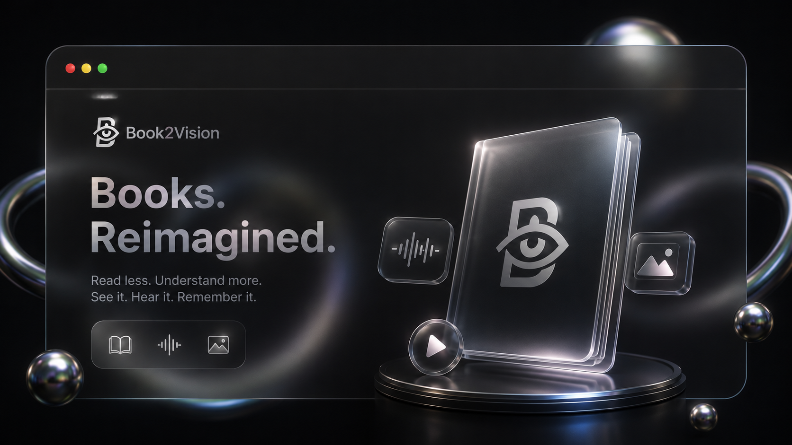
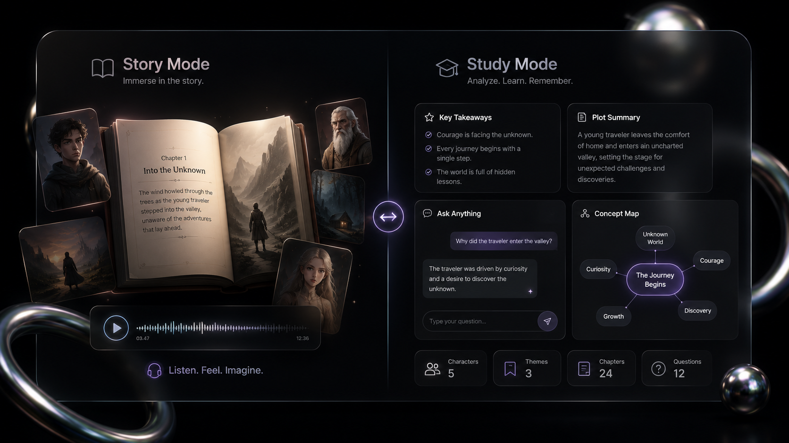
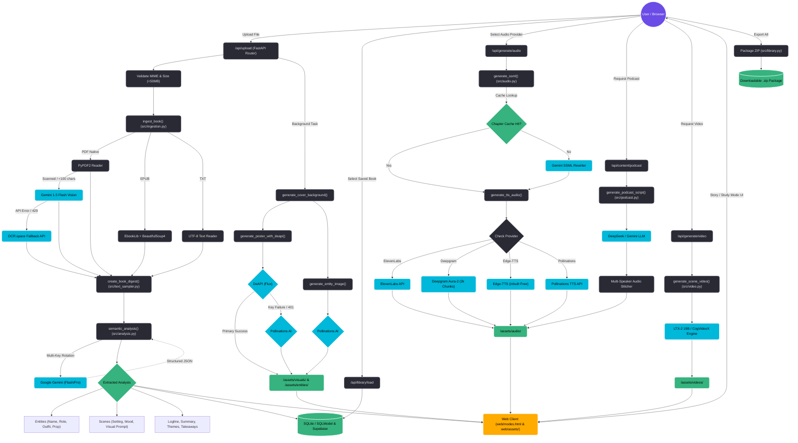

# 📚 Book2Vision

<p align="center">
  
</p>

<p align="center">
  <a href="#-tech-stack"></a>
  <a href="#-tech-stack"></a>
  <a href="#-tech-stack"></a>
  <a href="#-tech-stack"></a>
  <a href="#-tech-stack"></a>
  <a href="#-license"></a>
</p>

---

## 🌟 Overview

**Book2Vision** is an AI-powered multimedia transformation platform designed to turn traditional books (PDF, EPUB, TXT) into rich visual, auditory, and interactive digital experiences. 

By integrating Large Language Models, Multi-Provider Speech Synthesis, and Diffusion Image/Video engines, Book2Vision converts static literature into custom audiobooks, character art portraits, key scene galleries, multi-speaker conversational podcasts, animated video summaries, page-by-page illustrated storybooks, and intelligent Q&A study assistants.

---

## 🎯 Dual-Mode Experience

<p align="center">
  
</p>

Book2Vision offers two tailored consumption modes depending on user intent:

| Feature | 📖 Story Mode | 🎓 Study Mode |
| :--- | :--- | :--- |
| **Primary Goal** | Immersion, narrative enjoyment, visual storytelling | Comprehension, deep academic analysis, quick research |
| **Audio Generation** | Multi-speaker emotive audiobooks & narrative podcasts | Key takeaway narration & audio concept summaries |
| **Visual Art** | Scene galleries, character art portraits & video clips | Concept relationship graphs & structural mind maps |
| **Interactivity** | Page-by-page illustrated storybook view | Context-aware Q&A chatbot & interactive quizzes |
| **Target Content** | Fiction, novels, memoirs, fantasy, drama | Non-fiction, textbooks, research papers, documentation |

---

## 🚀 Key Features

- **📄 Multi-Format Document Ingestion**: Ingests PDF, EPUB, and TXT files. Handles scanned documents automatically via Tesseract OCR and Gemini 1.5 Flash layout-aware vision parsing with OCR.space fallback.
- **🧠 Semantic Narrative Engine**: Uses Google Gemini to extract characters, key scene settings, narrative arcs, loglines, themes, and key takeaways using a smart full-book text sampler (`create_book_digest`).
- **🎙️ Multi-Provider Audio Synthesis**: Generates natural speech using ElevenLabs, Deepgram (with automatic 2,000-character payload chunking), Edge-TTS (inbuilt free neural voices), and Pollinations TTS. Includes SSML enhancement and database caching.
- **🖼️ AI Character & Scene Art**: Generates character portraits and key scene illustrations using DeAPI (Flux model) with automatic fallback to Pollinations AI.
- **🎙️ Conversational AI Podcasts**: Generates multi-speaker podcast scripts using DeepSeek or Gemini, synthesizing conversational host episodes discussing story arcs or study themes.
- **🎬 Animated Video Summaries**: Produces video highlights using LTX-2 19B and CogVideoX models from generated illustrations.
- **📖 Page-by-Page Illustrated Storybook**: Adapts books into an illustrated reading mode matching text blocks with visual scene artwork.
- **💬 Intelligent Q&A Chatbot**: Ask questions directly about the uploaded book with instant context-backed answers and quizzes.
- **💾 Persistent Library & ZIP Export**: Database-backed book storage (SQLite / SQLModel & Supabase sync) with metadata, cover reloading, and one-click ZIP package exports.

---

## 🏗️ System Architecture & Data Flow

Below is the verified system flowchart based on deep codebase analysis across ingestion, semantic extraction, visual/audio dispatching, storage, and frontend presentation:



---

## 🛠️ Tech Stack

| Layer | Technology & Libraries | Description |
| :--- | :--- | :--- |
| **Backend Framework** | Python 3.10+, FastAPI, Uvicorn | High-performance asynchronous REST API server |
| **AI Intelligence / LLMs** | Google Gemini (1.5 Flash/Pro), DeepSeek | Document reading, entity & scene extraction, podcast scripting, Q&A |
| **NLP & Vision** | Spacy (`en_core_web_sm`), Tesseract OCR | Named Entity Recognition (NER), layout OCR for scanned PDFs |
| **Speech Synthesis (TTS)** | ElevenLabs, Deepgram, Edge-TTS, Pollinations TTS | Multi-speaker TTS, voice cloning, automatic text chunking |
| **Visual & Video AI** | DeAPI (Flux), Pollinations AI, LTX-2 19B, CogVideoX | Character portrait art, scene galleries, video synthesis |
| **Database & Storage** | SQLModel, SQLite, Supabase | Book metadata, cached SSML scripts, user libraries, media asset paths |
| **Document Parsing** | PyPDF2, EbookLib, BeautifulSoup4 | Native PDF, EPUB, and TXT parsing engines |
| **Frontend UI** | HTML5, Vanilla CSS3 (Glassmorphism), JavaScript (ES6+) | Responsive dashboard, modal audio/video players, storybook reader |

---

## 📋 Prerequisites & Installation

### 1. System Requirements

- **Python 3.10 or higher**
- **Git**
- **Tesseract OCR** (Required for scanned PDF document parsing):
  - **Windows**: Download installer from [UB Mannheim Tesseract Wiki](https://github.com/UB-Mannheim/tesseract/wiki) and add to PATH.
  - **macOS**: `brew install tesseract`
  - **Linux**: `sudo apt-get install tesseract-ocr`

---

### 2. Step-by-Step Installation

1. **Clone the Repository**:
   ```bash
   git clone https://github.com/spigelspike/Book2Vision.git
   cd Book2Vision
   ```

2. **Create and Activate Virtual Environment**:
   - **Linux / macOS**:
     ```bash
     python3 -m venv venv
     source venv/bin/activate
     ```
   - **Windows (PowerShell)**:
     ```powershell
     python -m venv venv
     .\venv\Scripts\Activate.ps1
     ```

3. **Install Python Dependencies**:
   ```bash
   pip install -r requirements.txt
   ```

4. **Download Spacy Language Model**:
   ```bash
   python -m spacy download en_core_web_sm
   ```

---

## ⚙️ Environment Configuration (`.env`)

Create a `.env` file in the project root directory (see `.env.example`). Below is the configuration key reference:

```env
# ==========================================
# Primary LLM API Keys
# ==========================================
# Supports comma-separated keys for load balancing & key rotation
GEMINI_API_KEY=your_gemini_api_key_1,your_gemini_api_key_2
DEEPSEEK_API_KEY=your_deepseek_api_key
OPENROUTER_API_KEY=your_openrouter_api_key

# ==========================================
# Audio Synthesis (TTS) Keys
# ==========================================
ELEVENLABS_API_KEY=your_elevenlabs_api_key
DEEPGRAM_API_KEY=your_deepgram_api_key
PODCAST_API_KEY=your_podcast_dedicated_api_key

# ==========================================
# Visual Generation Keys
# ==========================================
DEAPI_API_KEY=your_deapi_api_key
POLLINATIONS_API_KEY=your_pollinations_api_key

# ==========================================
# Storage & Database (Optional Supabase Sync)
# ==========================================
DATABASE_URL=sqlite:///./book2vision.db
SUPABASE_URL=https://your-supabase-project.supabase.co
SUPABASE_KEY=your_supabase_anon_key
```

---

## 🚀 Running the Application

1. **Start the Server**:
   ```bash
   python src/server.py
   ```
   *Or directly with Uvicorn:*
   ```bash
   uvicorn src.server:app --host 0.0.0.0 --port 8000 --reload
   ```

2. **Open Web Portal**:
   Navigate to `http://localhost:8000` in your web browser.

3. **Transform a Book**:
   - Upload a PDF, EPUB, or TXT file.
   - Choose between **Story Mode** or **Study Mode**.
   - Trigger visual galleries, audiobooks, podcasts, or Q&A chatbot features.

---

## 📡 API Reference Matrix

The FastAPI backend exposes modular endpoints defined across `src/routers/`:

| Endpoint | Method | Description |
| :--- | :--- | :--- |
| `/api/upload` | `POST` | Uploads book, extracts text, runs semantic analysis & background cover generation |
| `/api/generate/analysis` | `POST` | Manually triggers Gemini LLM semantic analysis on book digest |
| `/api/generate/audio` | `POST` | Synthesizes TTS audiobook audio using selected provider (ElevenLabs/Deepgram/Edge-TTS) |
| `/api/generate/visuals` | `POST` | Generates cover poster, character portraits, and scene art |
| `/api/generate/video` | `POST` | Generates animated scene video highlights via LTX-2 / CogVideoX |
| `/api/content/podcast` | `POST` | Generates multi-speaker conversational AI podcast script & audio |
| `/api/content/storybook` | `GET` | Returns page-by-page illustrated storybook dataset |
| `/api/content/qa` | `POST` | Queries context-backed AI chatbot about book contents |
| `/api/library` | `GET` | Fetches saved books from database with metadata and thumbnails |
| `/api/library/{book_id}/export` | `GET` | Packages book text, analysis, audio, and images into downloadable `.zip` |

---

## 📂 Project Directory Structure

```text
book2vision/
├── src/
│   ├── server.py             # FastAPI app entry point, CORS, & static mounts
│   ├── config.py             # Environment config, key allocation, & defaults
│   ├── state.py              # Central application state manager
│   ├── database.py           # SQLModel database schema & engine
│   ├── ingestion.py          # PDF/EPUB/TXT extraction & Tesseract/Gemini OCR
│   ├── text_sampler.py       # Smart book digestion & text chunking
│   ├── analysis.py           # Gemini LLM narrative extraction & entity mapping
│   ├── audio.py              # Multi-provider TTS engine, SSML, & chunking
│   ├── visuals.py            # DeAPI (Flux) & Pollinations image generators
│   ├── video.py              # LTX-2 & CogVideoX video summary synthesis
│   ├── podcast.py            # Script generator & multi-speaker audio builder
│   ├── storybook.py          # Page-by-page illustrated storybook generator
│   ├── knowledge.py          # Intelligent Q&A chatbot & quiz engine
│   ├── library.py            # Persistent library manager & ZIP exporter
│   └── routers/              # Modular FastAPI API routers
│       ├── upload.py         # Ingestion endpoints
│       ├── generation.py     # Audio, visual, and video generation routes
│       ├── content.py        # Podcast, storybook, and Q&A routes
│       ├── library.py        # Library CRUD & export routes
│       └── music.py          # Background music routes
├── web/                      # Frontend web application
│   ├── assets/               # CSS styling, JS modules, and project media
│   │   ├── hero.png          # README & Hero Banner graphic
│   │   ├── dual_mode.png     # README Story Mode vs Study Mode graphic
│   │   └── styles/           # UI CSS stylesheets
│   └── modes.html            # Main web portal interface
├── tests/                    # Unit & integration test suite
├── .env.example              # Environment variables template
├── Dockerfile                # Container deployment file
├── pipeline.md               # Visual system pipeline documentation
├── requirements.txt          # Python dependencies manifest
└── README.md                 # System documentation
```

---

## 💡 Troubleshooting & FAQ

<details>
<summary><b>1. TesseractNotFoundError: tesseract is not installed or it's not in your PATH</b></summary>
<br />
Ensure Tesseract OCR is installed on your OS. On Windows, verify `C:\Program Files\Tesseract-OCR` is added to your environment variables PATH.
</details>

<details>
<summary><b>2. Spacy Model Missing: OSError: [E050] Can't find model 'en_core_web_sm'</b></summary>
<br />
Run `python -m spacy download en_core_web_sm` inside your activated virtual environment.
</details>

<details>
<summary><b>3. Deepgram API 400 Error: Character Limit Exceeded</b></summary>
<br />
Deepgram has a 2,000 character limit per request. Book2Vision handles this automatically by chunking text into sub-sentences in `src/audio.py`. Ensure your API key has active credits.
</details>

<details>
<summary><b>4. DeAPI 401 Unauthorized / Image Generation Fallback</b></summary>
<br />
If your DeAPI key expires or fails, Book2Vision automatically falls back to **Pollinations AI** for continuous image generation.
</details>

---

## 📄 License

This project is open-source and intended for educational, research, and personal use.

---

<p align="center">
  Crafted with ❤️ by the <b>Book2Vision</b> Team
</p>
