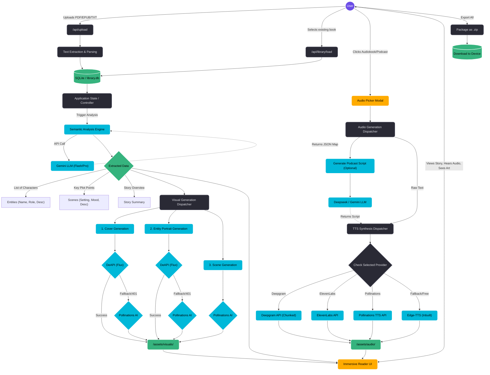

# Book2Vision System Pipeline

Here is the full system architecture and data flow pipeline for Book2Vision, visualized as a Mermaid flowchart. 

### Key Phases Breakdown

1. **Input & Extraction:** The system ingests files, extracts the raw text, and stores the metadata in a local SQLite database (`library.db`).
2. **Semantic Analysis:** The raw text is passed to an LLM (primarily Gemini Flash/Pro) which acts as the "brain". It breaks the story down into characters (entities), settings (scenes), and summaries.
3. **Visual Generation:** 
   - Uses the extracted entities to generate consistent character portraits.
   - Uses the scene descriptions and character data to generate matching scene backgrounds.
   - Defaults to **deAPI (Flux)** for high quality, with an automatic, safe fallback to **Pollinations AI** if the API key fails.
4. **Audio Generation:** The user selects a provider via the new dashboard modal. Large texts are intelligently chunked (e.g., for Deepgram's 2,000 character limit), processed into speech, and stitched together.
5. **Presentation:** Everything converges on the frontend. The Immersive Reader matches audio timestamps with scene images and text, creating a multimedia reading experience.
